# CLAUDE.md

This file provides guidance to Claude Code (claude.ai/code) when working with code in this repository.

---

## Project Purpose

Academic course generation system for creating professional 8-week finance courses with Beamer slides, charts, and comprehensive materials. Current focus: Green Finance Professional Certificate with learning-goal-driven pedagogy.

---

## Critical Build Commands

### Generate Charts
```bash
# Generate all Week N charts (run from project root)
python charts/weekN/week1_v2_goal2_chart1_market_growth.py

# Generate Graphviz diagrams (requires Graphviz installed)
dot -Tpdf charts/weekN/chart_name.dot -o charts/weekN/chart_name.pdf

# Batch generate all charts for a week (bash/Linux/WSL)
for f in charts/week1/*.py; do python "$f"; done
for f in charts/week1/*.dot; do dot -Tpdf "$f" -o "${f%.dot}.pdf"; done

# PowerShell alternative for Windows
Get-ChildItem charts\week1\*.py | ForEach-Object { python $_.FullName }
Get-ChildItem charts\week1\*.dot | ForEach-Object { dot -Tpdf $_.FullName -o ($_.FullName -replace '\.dot$','.pdf') }
```

### Compile LaTeX Slides
```bash
# Compile single week (2 passes for references)
pdflatex -interaction=nonstopmode YYYYMMDD_HHMM_WeekN_Title.tex
pdflatex -interaction=nonstopmode YYYYMMDD_HHMM_WeekN_Title.tex

# Clean auxiliary files after compilation (bash/Linux/WSL)
mv *.aux *.log *.out *.nav *.toc *.snm temp/ 2>/dev/null

# PowerShell alternative for Windows
Move-Item -Path *.aux,*.log,*.out,*.nav,*.toc,*.snm -Destination temp\ -ErrorAction SilentlyContinue
```

### Verify Output
```bash
# Check chart generation success
ls -lh charts/week1/*.pdf | wc -l  # Should match expected count

# Check PDF page count
pdfinfo Week1_*.pdf | grep Pages

# Verify chart ratio (charts/slides should be ≥0.33)
```

---

## Interactive Web Platform

**React Application:** `react-app/` directory contains an interactive web-based version of Week 1.

### Quick Start
```bash
cd react-app
npm install
npm start
# Opens at http://localhost:3000
```

### Features
- 30 interactive slides with keyboard navigation (Arrow keys)
- Progress tracking saved to localStorage
- Interactive charts using Recharts
- Self-assessment quizzes
- Matching color scheme (mlpurple/mllavender)

### Build for Production
```bash
cd react-app
npm run build
# Creates optimized build in build/ directory
```

**See:** `react-app/README.md` for detailed documentation.

---

## Architecture Overview

### Multi-Agent System (v2.0)

**4-Agent Architecture for Course Generation:**

```
Course Orchestrator (Master)
    ├─→ Guidelines Expert → guidelines_validated.yaml
    ├─→ Content Planner v2.0 → content_outline_v2.yaml
    └─→ Slide Generator v2.0 → Week1-8.pdf + charts/
```

**Key Principle:** File-based communication between agents using structured YAML.

**Agent Specifications Location:** `agents/AGENT_[1-4]_*.md`

### Learning-Goal-Driven Structure (v2.0)

**Core Innovation:** Every week has exactly **3 learning goals** forming narrative:

```yaml
learning_goals:
  - goal_number: 1
    type: "theoretical" | "mathematical" | "quantitative" | "applied"
    narrative_role: "Foundation - Establishes core concepts"
    slides_allocated: 10

  - goal_number: 2
    narrative_role: "Build - Develops analytical tools"
    slides_allocated: 10

  - goal_number: 3
    narrative_role: "Apply - Demonstrates implementation"
    slides_allocated: 10
```

**Key Rule:** 3 sessions per week (one per goal), NOT 4.

**Narrative Progression:** Foundation → Build → Apply (WHY → HOW MUCH → HOW TO)

---

## File Structure

### Core System Files
- `COURSE_GENERATOR_v2.md` - Complete generation system specification with color scheme, layouts, quality control
- `template_beamer_final.tex` - Madrid theme template (REQUIRED for all slides)

### Agent Specifications (agents/)
- `AGENT_1_CourseOrchestrator.md` - Master coordinator
- `AGENT_2_GuidelinesExpert.md` - Validates guidelines, extracts specs
- `AGENT_3_ContentPlanner_v2.md` - Generates 3-goal content outlines
- `AGENT_4_SlideGenerator_v2_LaTeXTemplates.md` - New slide layouts
- `SCHEMAS_Communication_v2.yaml` - Data exchange formats
- `README_v2.md` - System documentation

### Generated Files Pattern
- `YYYYMMDD_HHMM_WeekN_Title.tex` - LaTeX source (timestamp prefix mandatory)
- `YYYYMMDD_HHMM_WeekN_Title.pdf` - Compiled slides
- `weekN_v2_content_outline.yaml` - Detailed content specification
- `charts/weekN/weekN_v2_goalN_chartM_description.[py|dot|pdf]` - Chart files

### Directory Structure
```
GreenFinance/
├── agents/                  # Agent specifications
├── charts/week1-8/         # Chart scripts and PDFs
├── react-app/              # Interactive web platform (React)
├── temp/                   # Auxiliary LaTeX files (.aux, .log, etc.)
├── previous/               # Archived versions
├── template_beamer_final.tex  # REQUIRED template
└── COURSE_GENERATOR_v2.md     # REQUIRED guidelines
```

---

## Template and Color Scheme

### Madrid Theme Configuration
- **Theme:** Madrid (Beamer)
- **Font size:** 8pt
- **Aspect ratio:** 16:9 (aspectratio=169)
- **Color scheme:** mlpurple/mllavender (CRITICAL: Use these colors)

### Color Definitions (MUST USE)
```latex
% LaTeX colors
\definecolor{mlpurple}{RGB}{51,51,178}      % Primary
\definecolor{mllavender}{RGB}{173,173,224}  % Secondary
\definecolor{mllavender2}{RGB}{193,193,232}
\definecolor{mllavender3}{RGB}{204,204,235}
\definecolor{mllavender4}{RGB}{214,214,239}
\definecolor{mlgreen}{RGB}{44,160,44}
\definecolor{mlorange}{RGB}{255,127,14}
```

### Python Chart Colors (CRITICAL)
```python
COLORS = {
    'primary': '#3333B2',     # mlpurple - USE THIS, NOT GREEN
    'secondary': '#ADADE0',   # mllavender
    'success': '#2CA02C',     # mlgreen
    'warning': '#FF7F0E',     # mlorange
    'neutral': '#7F7F7F'      # mlgray
}
```

**CRITICAL:** Never use hardcoded colors like `'#2C9F2C'` or `'green'`. Always use `COLORS['primary']` for consistency with template.

---

## New Slide Types (v2.0)

### 1. Learning Goal Title (Slides 1, 11, 21)
```latex
\begin{frame}[plain]
\vfill
\centering
\begin{beamercolorbox}[sep=12pt,center]{title}
{\Huge \textbf{Learning Goal 1}}\\[1.5em]
{\Large Goal statement here}\\[1em]
{\normalsize \textcolor{mllavender}{type | narrative role}}
\end{beamercolorbox}
\vfill
\end{frame}
```

### 2. Goal Summary (Slides 10, 20, 30)
```latex
\begin{frame}[t]{Learning Goal N: Summary}
\begin{columns}[T]
\column{0.48\textwidth}
\textbf{What We Achieved}
\begin{itemize}
\item \textcolor{mlgreen}{$\checkmark$} Achievement 1
\end{itemize}

\column{0.48\textwidth}
\textbf{Can You Now...}
\begin{itemize}
\item Self-assessment question?
\end{itemize}
\end{columns}
\bottomnote{[Goal N] Achieved - transition text}
\end{frame}
```

Requires: `\usepackage{amssymb}` for checkmark symbol.

### 3. Mathematical Derivation
```latex
\begin{frame}[t]{Derivation Title}
\begin{columns}[T]
\column{0.48\textwidth}
\textbf{Starting Point}
$$P_0 = \sum_{t=1}^{T} \frac{C}{(1+r)^t}$$

\textbf{Assumptions:}
\begin{itemize}
\item Assumption 1
\end{itemize}

\column{0.48\textwidth}
\textbf{Derivation Steps}
\begin{enumerate}
\item Step explanation
\begin{equation*}
equation here
\end{equation*}
\end{enumerate}
\end{columns}
\bottomnote{[Goal N] Mathematical explanation}
\end{frame}
```

### 4. Framework Overview
```latex
\begin{frame}[t]{Framework Title}
\begin{center}
{\large \textbf{Framework Name}}
\end{center}
\vspace{0.5em}
\begin{columns}[T]
\column{0.48\textwidth}
\textbf{Core Principles}
\begin{itemize}
\item Principle 1
\end{itemize}

\column{0.48\textwidth}
\textbf{Components}
\begin{itemize}
\item Component 1
\end{itemize}
\end{columns}
\bottomnote{[Goal N] Framework explanation}
\end{frame}
```

---

## Chart Generation Patterns

### Python Chart Template
Every Python chart MUST include COLORS dictionary and use template colors:

```python
import matplotlib.pyplot as plt
import numpy as np

# CRITICAL: Template colors
COLORS = {
    'primary': '#3333B2',    # mlpurple
    'secondary': '#ADADE0',  # mllavender
    'success': '#2CA02C',
    'neutral': '#7F7F7F'
}

def generate_chart():
    plt.style.use('seaborn-v0_8')
    fig, ax = plt.subplots(figsize=(10, 6))  # 16:9 aspect

    # ALWAYS use COLORS, never hardcode
    ax.plot(data, color=COLORS['primary'], linewidth=2.5)

    # Template styling
    ax.set_title('Title', fontsize=14, fontweight='bold',
                 color=COLORS['primary'])
    ax.grid(True, alpha=0.3, linestyle='--', color=COLORS['neutral'])
    ax.set_facecolor('#FAFAFA')
    fig.patch.set_facecolor('white')

    # Save as PDF
    plt.savefig('charts/weekN/chart.pdf', format='pdf', dpi=300,
                bbox_inches='tight', facecolor='white')
    plt.close()
```

### Graphviz Chart Template

```dot
digraph ChartName {
    rankdir=TB;
    node [shape=box, style="rounded,filled", fontname="Arial", fontsize=10];

    // Use template colors
    node [fillcolor="#D6D6EF"];  // mllavender4

    nodeA [label="Label", fillcolor="#C1C1E8"];

    labelloc="t";
    label="Chart Title";
    fontcolor="#3333B2";  // mlpurple
}
```


---

## Overflow Prevention

**CRITICAL RULE:** Maximum 6 bullets per column in two-column slides.

**If exceeding 6 bullets:** Auto-split into multiple slides with "(Part 1 of 2)" notation.

**Layout specification:**
```latex
\begin{columns}[T]
\column{0.48\textwidth}
% MAX 6 items here
\column{0.48\textwidth}
% MAX 6 items here
\end{columns}
```

---

## Bottom Notes

**REQUIRED on every slide:**
```latex
\bottomnote{[Goal N] Key takeaway or context}
```

**v2.0 Requirement:** All bottom notes must include `[Goal N]` prefix where N ∈ {1, 2, 3}.

**Example:** `\bottomnote{[Goal 2] Market data validates theoretical predictions from Goal 1}`

---

## Quality Requirements

### Per Week Targets
- **Slides:** 30-32 (typically 30)
- **Charts:** 10-11 (typically 10)
- **Chart ratio:** ≥33% (10/30 = 33.3%)
- **Sessions:** Exactly 3 (one per learning goal)
- **Learning goals:** Exactly 3 (typed with narrative roles)

### Slide Distribution
```
Session 1 (Goal 1): Slides 1-10
  - Slide 1: Learning goal title
  - Slides 2-9: Content
  - Slide 10: Goal summary

Session 2 (Goal 2): Slides 11-20
  - Slide 11: Learning goal title
  - Slides 12-19: Content
  - Slide 20: Goal summary

Session 3 (Goal 3): Slides 21-30
  - Slide 21: Learning goal title
  - Slides 22-29: Content
  - Slide 30: Goal summary + week integration
```

### Goal Types and Usage
- **Mathematical:** Include derivation slides (equations, steps)
- **Theoretical:** Include framework overview slides
- **Quantitative:** Include data analysis and metrics
- **Applied:** Include case studies and applications

**Pattern:** Most weeks should have 1 mathematical or theoretical goal for academic rigor.

---

## Common Workflows

### Generate Single Week (v2.0)
```bash
# 1. Create content outline (3 goals, 3 sessions)
# Edit: weekN_v2_content_outline.yaml

# 2. Generate all charts
for f in charts/weekN/*.py; do python "$f"; done
for f in charts/weekN/*.dot; do dot -Tpdf "$f" -o "${f%.dot}.pdf"; done

# 3. Generate LaTeX
# Use agents/AGENT_4_SlideGenerator_v2_LaTeXTemplates.md for patterns

# 4. Compile
pdflatex -interaction=nonstopmode YYYYMMDD_HHMM_WeekN_Title.tex
pdflatex -interaction=nonstopmode YYYYMMDD_HHMM_WeekN_Title.tex

# 5. Clean up
mv *.aux *.log *.out *.nav *.toc *.snm temp/

# 6. Validate
# Check: 30 slides, 10 charts, 33.3% ratio, 3 learning goals
```

### Generate Full Course
```bash
# Use orchestrator agent when available, or iterate (bash/Linux/WSL):
for week in {1..8}; do
    # Generate content outline for week
    # Generate charts
    # Generate LaTeX
    # Compile PDF
done

# PowerShell alternative for Windows
1..8 | ForEach-Object {
    # Generate content outline for week $_
    # Generate charts
    # Generate LaTeX
    # Compile PDF
}
```

### Prerequisites Check
```bash
# Verify required tools are installed
python --version        # Python 3.x
pdflatex --version      # TeX Live or MiKTeX
dot -V                  # Graphviz for diagrams
npm --version           # Node.js (for react-app)
```

---

## Special LaTeX Handling

### Required Packages
```latex
\usepackage{graphicx}    % For \includegraphics
\usepackage{booktabs}    % For tables
\usepackage{adjustbox}   % For content fitting
\usepackage{multicol}    % For multi-column
\usepackage{amsmath}     % For math
\usepackage{amssymb}     % For checkmark symbol (v2.0)
```

### PDF Compatibility
Add to preamble if charts don't embed:
```latex
\pdfminorversion=5  % or 7 for newer PDFs
```

### Special Character Escaping
```latex
& → \&
% → \%
$ → \$
# → \#
_ → \_
```

**Example:** "Oil & Gas" must be written as "Oil \& Gas" in LaTeX.

---

## Version Control

### v1.0 (Original)
- 4 learning objectives (generic)
- 4 sessions per week
- No goal tracking
- Standard slide types only

### v2.0 (Current - Recommended)
- **3 learning goals** (typed with narrative progression)
- **3 sessions per week** (one per goal)
- **Goal tracking** throughout (`[Goal N]` markers)
- **4 new slide types:** learning_goal_title, goal_summary, mathematical_derivation, framework_overview

**Use v2.0 for all new generation.**

**Key Files for v2.0:**
- `agents/AGENT_3_ContentPlanner_v2.md`
- `agents/AGENT_4_SlideGenerator_v2_LaTeXTemplates.md`
- `agents/SCHEMAS_Communication_v2.yaml`
- `agents/README_v2.md`

---

## Critical Design Rules

### Learning Goals (v2.0)
1. **Always exactly 3 goals per week** (never 4)
2. Each goal must have **type** field
3. Goals must form **narrative progression** (foundation → build → apply)
4. Each goal gets **one dedicated session** (~10 slides)
5. First slide of session: Learning goal title
6. Last slide of session: Goal summary with self-assessment

### Chart Generation
1. **Color consistency:** Use COLORS dictionary, never hardcode colors
2. **Aspect ratio:** (10, 6) for matplotlib (16:9 for beamer)
3. **Template colors:** mlpurple (#3333B2) primary, NOT green
4. **Chart ratio:** ≥33% of slides must be charts (10 charts per 30 slides)
5. **Goal alignment:** Charts support specific learning goals

### Slide Layouts
1. **Two-column default:** 0.48\textwidth each
2. **Max bullets:** 6 per column (overflow prevention)
3. **Bottom note:** Required on every slide with `[Goal N]` prefix
4. **Chart embedding:** `\includegraphics[width=0.9\textwidth]{charts/weekN/chart.pdf}`

---

## Troubleshooting

### Windows-Specific Issues
**Problem:** Path-related errors with forward slashes
**Solution:** Use backslashes or PowerShell commands provided in this document

**Problem:** Bash commands not working
**Solution:** Use PowerShell alternatives or Windows Subsystem for Linux (WSL)

### Chart Colors Wrong
**Problem:** Charts use green instead of purple
**Solution:** Verify COLORS dictionary uses `#3333B2` (mlpurple), not `#2C9F2C`

### LaTeX Compilation Error: "Misplaced alignment tab"
**Problem:** Unescaped & character
**Solution:** Replace `&` with `\&` in all text

### Charts Not Embedding
**Problem:** Missing image placeholders in PDF
**Solution:**
1. Verify chart PDF exists: `ls charts/weekN/chart_name.pdf`
2. Add `\pdfminorversion=5` to preamble
3. Use correct path: `charts/weekN/chart.pdf` (relative from .tex file)

### Wrong Number of Learning Goals
**Problem:** Generated 4 objectives instead of 3 goals
**Solution:** Use v2.0 agents (`AGENT_3_ContentPlanner_v2.md`), not v1.0

### Session Count Wrong
**Problem:** 4 sessions generated
**Solution:** v2.0 requires 3 sessions (one per learning goal)

---

## Goal Type Selection Guide

**Choose goal types based on week theme and narrative:**

- **Week 1-2 (Foundations):** Theoretical → Mathematical/Quantitative → Applied
- **Week 3-4 (Methods):** Theoretical → Quantitative → Applied
- **Week 5-6 (Applications):** Mathematical → Quantitative → Applied
- **Week 7-8 (Advanced):** Theoretical → Applied → Applied

**Balance across course:** Include mathematical derivations, theoretical frameworks, quantitative analysis, and applied cases.

---

## Agent Communication Protocol

**Guidelines Expert Output:**
```yaml
# guidelines_validated.yaml
course: {title, weeks, hours_per_week}
technical: {template, theme, colors}
layout: {column_width, max_bullets}
quality: {chart_ratio, slides_per_week, charts_per_week}
```

**Content Planner v2.0 Output:**
```yaml
# content_outline_v2.yaml
weeks:
  - learning_goals: [3 goals with types and narrative_role]
    sessions: [3 sessions, one per goal]
    slides: [30 slides with goal_reference field]
```

**Slide Generator v2.0 Output:**
- LaTeX files with v2.0 slide types
- Chart scripts with COLORS dictionary
- Compiled PDFs
- generation.log

---

## Examples and References

**See working examples:**
- `week1_v2_content_outline.yaml` - Complete Week 1 content spec
- `EXAMPLE_Week1_v2_3Goals.yaml` - Detailed example with all fields
- `20251120_0835_Week1_v2_GreenFinanceFoundations.pdf` - Compiled output

**Read for implementation:**
- `agents/IMPROVEMENTS_v2_Summary.md` - What changed in v2.0
- `week1_v2_validation_report.md` - Quality validation example

---

## Performance Expectations

**Per Week (v2.0):**
- Content outline creation: 5-10 minutes
- Chart generation: 2-3 minutes (10 charts)
- LaTeX generation: 1-2 minutes
- PDF compilation: 2-3 minutes
- **Total: ~15-20 minutes per week**

**Full Course (8 weeks):**
- Content planning: 40-60 minutes
- Chart generation: 15-20 minutes (85 charts)
- Slide generation: 10-15 minutes
- Compilation: 15-20 minutes
- **Total: ~90-120 minutes** (fully automated)

---

## Critical Warnings

⚠️ **DO NOT:**
- Generate 4 learning goals (use exactly 3)
- Use hardcoded colors (always use COLORS dictionary)
- Create 4 sessions (use exactly 3, one per goal)
- Forget `[Goal N]` prefix in bottom notes
- Exceed 6 bullets per column (causes overflow)
- Skip learning goal title or summary slides

✅ **DO:**
- Read `agents/README_v2.md` for complete system understanding
- Use template_beamer_final.tex preamble exactly
- Follow 3-goal narrative structure (foundation → build → apply)
- Include mathematical derivations for math-type goals
- Include framework diagrams for theory-type goals
- Validate chart ratio ≥33% (10 charts minimum per 30 slides)

---

**Current State:** Week 1 v2.0 successfully refined (37 slides). Ready for Weeks 2-8 generation.

---

## Recent Refinements (November 2024)

### Week 1 v2.0 Enhanced Structure (37 slides)
- **Core**: 30 slides (3 goals × 10 slides each) maintaining v2.0 specification
- **Supplementary**: 7 additional empirical validation slides (slides 32-37)
- **Total charts**: 17 (11 in core goals 1-3 + 6 supplementary)
- **Rationale**: Supplementary slides provide additional evidence without disrupting 3-goal narrative

**Structure:**
```
Slides 1-30:   Core v2.0 structure (Goals 1-3)
Slide 31:      Week integration summary
Slides 32-37:  Supplementary empirical charts
```

### Key Refinements Applied
1. **Greenium Data Correction**:
   - ❌ Old: Constant 20 bps (unrealistic)
   - ✅ New: Declining 2-7 bps (7 bps in 2019 → 2 bps in 2024)
   - Source: Amundi 2024, Robeco 2024, CEPR studies

2. **Statistics Verification**:
   - ❌ "Over 96% verification" → ✅ "Over 80% (OECD 2024)"
   - ❌ "100% investment grade" → ✅ "predominantly investment grade"
   - ✓ $2.04T investment gap verified (McKinsey/World Bank)
   - ✓ Issuer volumes verified (EIB, France)

3. **Missing Content Added**:
   - Added Goal 3 Chart 4 (greenium time series) as slide 30
   - All supplementary slides now use proper [Goal N] bottom notes

4. **File Management**:
   - Previous version archived to `previous/` folder
   - 13 old v1.0 charts moved to `previous/charts_v1/`

---

## Statistics Verification Protocol

**Critical Requirement:** All claims, statistics, and case studies MUST be verified via web search.

### Verification Workflow

**Step 1: Identify Claims Requiring Verification**
- Market size figures (e.g., "$2.1T market")
- Growth rates (e.g., "24.9% CAGR")
- Percentages (e.g., "96% verification rate")
- Specific volumes (e.g., "EIB $85B")
- Academic findings (e.g., "greenium 3-4 bps")

**Step 2: Web Search for Recent Sources**
```bash
# Prefer 2024 sources for current data
"green bond market size 2024"
"green bond greenium basis points 2024 academic research"
"OECD green bond verification rate 2024"
"EIB green bond issuance total volume 2024"
```

**Step 3: Update Slides**
- Replace unverified data with verified figures
- Add source citations in bottom notes when appropriate
- Soften absolute claims (e.g., "100%" → "predominantly")
- Document sources in comment if detailed citation not in slide

### Example Corrections from Week 1
```latex
% Before
\bottomnote{[Supplementary] Over 96\% of green bonds have external review}

% After (verified with OECD 2024)
\bottomnote{[Goal 1] Over 80\% of green bonds have external review (OECD 2024)}
```

---

## Enhanced Quality Requirements

### Per Week Targets (Updated November 2024)
- **Core slides:** 30 (3 goals × 10 slides each) - STRICT
- **Total slides:** 30-37 (core + up to 7 supplementary) - FLEXIBLE
- **Core charts:** 10-11 minimum (Goals 1-3)
- **Total charts:** 15-17 (including supplementary)
- **Chart ratio:** ≥33% for core slides (10/30 = 33.3%)
- **Sessions:** Exactly 3 (one per learning goal)
- **Learning goals:** Exactly 3 (typed with narrative roles)

### Bottom Note Requirements
**ALL slides must use [Goal N] format:**
- Core slides 1-30: [Goal 1], [Goal 2], or [Goal 3]
- Week summary slide 31: Can reference multiple goals
- **Supplementary slides 32-37: MUST use [Goal N] based on content** (not [Supplementary])

**Example:**
```latex
% Investment gap chart supports Goal 2 (quantitative analysis)
\bottomnote{[Goal 2] \$2.04T annual gap demonstrates funding need}

% NOT
\bottomnote{[Supplementary] Investment gap information}
```

---

## Chart Data Best Practices

### Realistic Data Patterns

**Greenium (Green Premium):**
- **Pattern**: Declining over time (higher in early years, lower as supply meets demand)
- **Range**: 2-7 bps (not constant)
- **2024 values**: 1-3 bps for developed market sovereign bonds
- **Source**: Amundi 2024 (1.2 bps), Robeco 2024 (1-3 bps), CEPR studies

**Implementation:**
```python
# Realistic declining greenium pattern
years = np.array([2019, 2020, 2021, 2022, 2023, 2024])
green_yields = np.array([2.93, 1.94, 2.15, 3.56, 3.97, 3.78])
conv_yields = np.array([3.00, 2.00, 2.20, 3.60, 4.00, 3.80])
greenium_bps = (conv_yields - green_yields) * 100  # Results: 7→6→5→4→3→2 bps
```

**Avoid:**
- Constant greenium across all years
- Unrealistic values (e.g., 20 bps when text says 3-4 bps)
- Hardcoded data without research basis

---

## Troubleshooting Updates

### Issue: PDF Locked During Compilation
**Symptoms:** `I can't write on file '*.pdf'` error
**Cause:** PDF open in viewer (Windows file locking)
**Solution:**
```bash
# 1. Close PDF viewer completely
# 2. Then compile:
pdflatex -interaction=nonstopmode YYYYMMDD_HHMM_WeekN_Title.tex
pdflatex -interaction=nonstopmode YYYYMMDD_HHMM_WeekN_Title.tex

# 3. If still locked, rename old PDF first:
mv WeekN.pdf WeekN_old.pdf
pdflatex -interaction=nonstopmode YYYYMMDD_HHMM_WeekN_Title.tex
```

### Issue: Internal Data Inconsistencies
**Symptoms:** Chart shows different numbers than slide text
**Example:** Chart annotation "Average Greenium: 20.0 bps" but text says "3-4 bps"
**Diagnosis:** Chart generated with placeholder data, text updated but chart not regenerated
**Solution:**
1. Identify discrepancy via slide-by-slide review
2. Verify correct value via web search
3. Update Python chart script with verified data
4. Regenerate chart: `python charts/weekN/chart_name.py`
5. Verify chart PDF updated (check file timestamp)
6. Recompile slides

---

## File Cleanup After Major Refinements

After significant changes (data corrections, chart additions, statistical verification):

```bash
# 1. Archive previous version
mv YYYYMMDD_HHMM_WeekN_*.tex previous/
mv YYYYMMDD_HHMM_WeekN_*.pdf previous/20241122_WeekN_before_refinement.pdf

# 2. Clean up old chart files (v1.0 or superseded versions)
mkdir -p previous/charts_v1
mv charts/weekN/old_chart_name.pdf previous/charts_v1/

# 3. Move auxiliary files to temp
mv *.aux *.log *.out *.nav *.toc *.snm temp/

# 4. Verify clean state
ls -la 202*.pdf          # Should show only latest version
ls charts/week1/*.pdf    # Should show only current v2 charts
ls previous/             # Should contain archived versions
```

### Chart File Organization
**Current charts:**
```
charts/week1/week1_v2_goal1_chart1_ecosystem.pdf
charts/week1/week1_v2_goal2_chart1_market_growth.pdf
charts/week1/week1_v2_goal3_chart1_yields.pdf
charts/week1/11_investment_gap/11_investment_gap.pdf  # Supplementary
```

**Archived charts:**
```
previous/charts_v1/market_growth.pdf              # Old v1.0
previous/charts_v1/week1_chart1_market_growth.pdf # Old naming
```

---

## Compilation Verification Checklist

After completing Week N refinement, verify:

**File Counts:**
```bash
# Core slides: Should be 30 (or 30-37 with supplementary)
pdfinfo 20YYMMDD_HHMM_WeekN_*.pdf | grep "Pages:"

# Charts in Goals 1-3: Should be 10-11
ls charts/weekN/weekN_v2_goal*_chart*.pdf | wc -l

# Total charts (including supplementary): Should be 15-17
ls charts/weekN/*.pdf | wc -l
```

**Content Verification:**
- [ ] All statistics verified via web search
- [ ] No internal inconsistencies (chart data matches text)
- [ ] All bottom notes use [Goal N] format
- [ ] Chart colors use COLORS dictionary (no hardcoded colors)
- [ ] No compilation warnings (except PDF version - acceptable)
- [ ] Greenium data shows realistic pattern (declining over time)

**Quality Metrics:**
```bash
# Check chart ratio (should be ≥33%)
# For 30 core slides with 10 charts: 10/30 = 33.3% ✓
# For 37 total slides with 17 charts: 17/37 = 45.9% ✓
```

---

## Updated Current State

**Week 1 Status:** Fully refined and validated (37 slides, 17 charts, all statistics verified)
**Ready for:** Weeks 2-8 generation using Week 1 as proven template
**Key Lesson:** Content completeness (37 slides) preferred over strict adherence to 30-slide spec when additional empirical validation enhances course quality
