# Universal Course Generator System v2.0
## Configuration-Driven Academic Course Creation Framework with Template Integration

### Purpose
This document provides a complete, reusable system for generating professional academic courses with lectures, charts, and comprehensive materials. The system is configuration-driven, quality-controlled, fully aligned with template_beamer_final.tex, and highly automated.

### Prerequisites
- **Software Required:**
  - LaTeX distribution (MiKTeX/TeX Live)
  - Python 3.x with matplotlib, seaborn, numpy, pandas
  - Graphviz (dot command available)
  - PDF viewer
- **Template Files:**
  - `template_beamer_final.tex` (REQUIRED in course directory)
  - 8pt Madrid theme beamer setup with mlpurple/mllavender colors
- **Directory Structure:**
  - Working directory: `D:\Joerg\Research\slides\[CourseName]\`
  - Charts subdirectory: `charts/week1-8/`
  - Archive directory: `previous/`
  - Temp directory: `temp/`

---

## CONFIGURATION BLOCK

```yaml
# Course Configuration - Edit this section for your course
course_config:
  # Basic Information
  title: "Green Finance Professional Certificate"
  subtitle: "Intensive 8-Week Program"
  institution: "University Name"

  # Course Structure
  total_weeks: 8
  hours_per_week: 13-14
  total_hours: 108

  # Slide Specifications
  slides_per_week: [30, 32, 30, 30, 30, 32, 30, 32]  # Per week
  chart_ratio: 0.33  # 1/3 of slides must be charts
  charts_per_week: [10, 11, 10, 10, 10, 11, 10, 11]  # Calculated from ratio

  # Technical Settings
  template: "template_beamer_final.tex"
  beamer_theme: "Madrid"
  aspect_ratio: 169
  font_size: 8pt
  pdf_version: 5  # Set to 5 or 7 for compatibility

  # Visual Style - ALIGNED WITH TEMPLATE
  colors:
    mlpurple: "RGB(51,51,178)"      # Primary theme color
    mllavender: "RGB(173,173,224)"  # Secondary color
    mllavender2: "RGB(193,193,232)" # Light variant
    mllavender3: "RGB(204,204,235)" # Lighter variant
    mllavender4: "RGB(214,214,239)" # Lightest variant
    mlgreen: "RGB(44,160,44)"       # Success/positive
    mlorange: "RGB(255,127,14)"     # Warning/negative
    mlred: "RGB(214,39,40)"         # Error/critical
    mlgray: "RGB(127,127,127)"      # Neutral
    midgray: "RGB(180,180,180)"     # Annotations

  # Color codes for Python/Matplotlib
  python_colors:
    primary: "#3333B2"     # mlpurple
    secondary: "#ADADE0"   # mllavender
    light: "#C1C1E8"       # mllavender2
    lighter: "#CCCCEB"     # mllavender3
    lightest: "#D6D6EF"    # mllavender4
    success: "#2CA02C"     # mlgreen
    warning: "#FF7F0E"     # mlorange
    danger: "#D62728"      # mlred
    neutral: "#7F7F7F"     # mlgray

  # Layout Rules
  layout:
    default: "two-column"
    column_width: 0.48
    max_bullets_per_column: 6
    max_bullets_single: 8
    overflow_action: "auto-split"
    chart_width: 0.9  # Width for embedded charts
    figure_size: [10, 6]  # Default matplotlib figure size (16:9)

  # File Naming
  naming:
    timestamp_format: "YYYYMMDD_HHMM_"
    week_prefix: "Week"
    chart_prefix: "chart"
    use_descriptive_names: true

  # Quality Settings
  quality_control:
    validate_before_compile: true
    check_overflow: true
    verify_chart_ratio: true
    verify_chart_embedding: true
    verify_color_consistency: true
    test_compilation: true
    generate_logs: true
```

---

## WEEKLY CONTENT SPECIFICATIONS

```yaml
week_specifications:
  week_1:
    title: "Green Finance Foundations"
    sessions: 4
    topics:
      - "Introduction to Green Finance"
      - "Green Finance Ecosystem"
      - "Financial Instruments"
      - "Financial Fundamentals"
    charts:
      python:
        - market_growth_timeline
        - instrument_breakdown
        - regional_distribution
        - performance_comparison
        - investment_gap_analysis
        - sector_allocation
        - risk_return_scatter
      graphviz:
        - ecosystem_flowchart
        - participant_network
        - regulatory_framework

  week_2:
    title: "Green Bonds and Sustainable Debt"
    sessions: 4
    topics:
      - "Green Bond Markets"
      - "Issuance and Verification"
      - "Pricing and Greenium"
      - "Sustainability-Linked Bonds"
    charts:
      python:
        - bond_issuance_growth
        - greenium_analysis
        - geographic_distribution
        - sector_breakdown
        - pricing_comparison
        - yield_curves
        - maturity_profile
      graphviz:
        - issuance_process
        - verification_framework
        - slb_structure
        - bond_lifecycle

  # ... Continue for weeks 3-8
```

---

## TEMPLATE INTEGRATION

### LaTeX Preamble Template (MUST match template_beamer_final.tex)
```latex
% REQUIRED: Copy exact preamble from template_beamer_final.tex
\documentclass[8pt,aspectratio=169]{beamer}
\usetheme{Madrid}
\usepackage{graphicx}
\usepackage{booktabs}
\usepackage{adjustbox}
\usepackage{multicol}
\usepackage{amsmath}

% CRITICAL: Use exact color definitions from template
\definecolor{mlpurple}{RGB}{51,51,178}
\definecolor{mllavender}{RGB}{173,173,224}
\definecolor{mllavender2}{RGB}{193,193,232}
\definecolor{mllavender3}{RGB}{204,204,235}
\definecolor{mllavender4}{RGB}{214,214,239}
\definecolor{mlorange}{RGB}{255,127,14}
\definecolor{mlgreen}{RGB}{44,160,44}
\definecolor{mlred}{RGB}{214,39,40}
\definecolor{mlgray}{RGB}{127,127,127}
\definecolor{midgray}{RGB}{180,180,180}

% Apply custom colors to Madrid theme
\setbeamercolor{palette primary}{bg=mllavender3,fg=mlpurple}
\setbeamercolor{palette secondary}{bg=mllavender2,fg=mlpurple}
\setbeamercolor{palette tertiary}{bg=mllavender,fg=white}
\setbeamercolor{palette quaternary}{bg=mlpurple,fg=white}

\setbeamercolor{structure}{fg=mlpurple}
\setbeamercolor{section in toc}{fg=mlpurple}
\setbeamercolor{subsection in toc}{fg=mlblue}
\setbeamercolor{title}{fg=mlpurple}
\setbeamercolor{frametitle}{fg=mlpurple,bg=mllavender3}
\setbeamercolor{block title}{bg=mllavender2,fg=mlpurple}
\setbeamercolor{block body}{bg=mllavender4,fg=black}

% PDF compatibility setting
\pdfminorversion=5  % or 7 for newer PDFs

% Remove navigation symbols
\setbeamertemplate{navigation symbols}{}

% Clean itemize/enumerate
\setbeamertemplate{itemize items}[circle]
\setbeamertemplate{enumerate items}[default]

% Reduce margins for more content space
\setbeamersize{text margin left=5mm,text margin right=5mm}

% Bottom annotation command (Madrid-style)
\newcommand{\bottomnote}[1]{%
\vfill
\vspace{-2mm}
\textcolor{mllavender2}{\rule{\textwidth}{0.4pt}}
\vspace{1mm}
\footnotesize
\textbf{#1}
}
```

---

## EXECUTION PIPELINE

### STEP 1: Configuration Validation
```python
def validate_configuration():
    """
    Validates all configuration parameters before execution
    Including template file existence and color consistency
    Returns: Boolean success status
    """
    import os

    checks = {
        "template_exists": os.path.exists("template_beamer_final.tex"),
        "weeks_defined": len(week_specifications) == course_config.total_weeks,
        "charts_ratio": all(charts[i]/slides[i] >= 0.30 for i in range(weeks)),
        "dependencies": check_latex() and check_python() and check_graphviz(),
        "directory_writable": os.access(".", os.W_OK),
        "colors_defined": all(c in course_config.python_colors for c in
                              ['primary', 'secondary', 'success', 'warning'])
    }

    for check, passed in checks.items():
        print(f"[{'PASS' if passed else 'FAIL'}] {check}")

    return all(checks.values())
```

### STEP 2: Directory Structure Creation
```bash
# Create all required directories
mkdir -p charts/week{1..8}
mkdir -p previous
mkdir -p temp
mkdir -p output

# Log creation
echo "Directory structure created: $(date)" > generation.log
```

### STEP 3: Chart Generation System

#### Python Chart Template (COLOR-ALIGNED)
```python
# charts/week{N}/chart_{M}_{description}.py
import matplotlib.pyplot as plt
import numpy as np
import pandas as pd
from datetime import datetime

# CRITICAL: Import color scheme from configuration
COLORS = {
    'primary': '#3333B2',     # mlpurple
    'secondary': '#ADADE0',   # mllavender
    'light': '#C1C1E8',       # mllavender2
    'lighter': '#CCCCEB',     # mllavender3
    'lightest': '#D6D6EF',    # mllavender4
    'success': '#2CA02C',     # mlgreen
    'warning': '#FF7F0E',     # mlorange
    'danger': '#D62728',      # mlred
    'neutral': '#7F7F7F'      # mlgray
}

def generate_chart():
    """
    Chart: {description}
    Week: {N}
    Number: {M} of {total}
    Template-aligned color scheme
    """
    try:
        # Set consistent style matching beamer theme
        plt.style.use('seaborn-v0_8')

        # Use 16:9 aspect ratio for beamer compatibility
        fig, ax = plt.subplots(figsize=(10, 6))

        # Generate realistic simulated data
        # [Chart-specific code here]

        # IMPORTANT: Use template colors for all elements
        ax.plot(x_data, y_data, color=COLORS['primary'], linewidth=2.5)
        ax.fill_between(x_data, y_data, alpha=0.3, color=COLORS['primary'])

        # Consistent formatting matching template font
        ax.set_xlabel('X Label', fontsize=12, fontweight='bold',
                      fontfamily='sans-serif')
        ax.set_ylabel('Y Label', fontsize=12, fontweight='bold',
                      fontfamily='sans-serif')
        ax.set_title('Chart Title\\nSubtitle', fontsize=14, fontweight='bold',
                     fontfamily='sans-serif', color=COLORS['primary'])

        # Grid with template colors
        ax.grid(True, alpha=0.3, linestyle='--', color=COLORS['neutral'])

        # Set background to match beamer theme
        ax.set_facecolor('#FAFAFA')
        fig.patch.set_facecolor('white')

        # Save with error handling
        output_path = f'chart_{M}_{description}.pdf'
        plt.tight_layout()
        plt.savefig(output_path, format='pdf', dpi=300, bbox_inches='tight',
                    facecolor='white', edgecolor='none')
        print(f"SUCCESS: Generated {output_path}")
        return True

    except Exception as e:
        print(f"ERROR: Failed to generate chart_{M}: {e}")
        # Create placeholder if failed
        create_placeholder(f'chart_{M}_{description}.pdf')
        return False

def create_placeholder(filename):
    """Create a placeholder chart matching template colors"""
    fig, ax = plt.subplots(figsize=(10, 6))
    ax.text(0.5, 0.5, 'Chart Placeholder\\n[Generation Failed]',
            ha='center', va='center', fontsize=20,
            color=COLORS['neutral'], fontfamily='sans-serif')
    ax.set_xlim(0, 1)
    ax.set_ylim(0, 1)
    ax.axis('off')
    ax.set_facecolor(COLORS['lightest'])
    plt.savefig(filename, format='pdf', bbox_inches='tight')

if __name__ == "__main__":
    success = generate_chart()
    exit(0 if success else 1)
```

#### Graphviz Template (COLOR-ALIGNED)

```dot
// charts/week{N}/framework_{M}_{description}.dot
digraph Framework {
    // Consistent styling matching beamer template
    rankdir=TB;
    node [shape=box, style="rounded,filled", fontname="Arial", fontsize=10];
    edge [fontname="Arial", fontsize=9];

    // Color scheme matching beamer mllavender theme
    node [fillcolor="#D6D6EF"];  // mllavender4 (lightest)

    // Use template colors for different node types
    // mllavender3 for secondary nodes
    secondary [fillcolor="#CCCCEB"];
    // mllavender2 for important nodes
    important [fillcolor="#C1C1E8"];
    // mlpurple text for emphasis
    emphasized [fontcolor="#3333B2"];

    // Framework nodes
    // [Framework-specific content]

    // Title with template colors
    labelloc="t";
    label="Framework Title";
    fontsize=14;
    fontname="Arial Bold";
    fontcolor="#3333B2";  // mlpurple
}
```


### STEP 4: Slide Generation Rules

#### Overflow Detection Algorithm
```python
def check_overflow(content_lines, max_bullets=6):
    """
    Detects potential overflow and splits content
    """
    if len(content_lines) <= max_bullets:
        return [content_lines]  # No split needed

    # Split into multiple slides
    slides = []
    for i in range(0, len(content_lines), max_bullets):
        slides.append(content_lines[i:i+max_bullets])

    return slides
```

#### LaTeX Generation Templates

##### Standard Two-Column Content Slide
```latex
% Auto-generated slide with overflow protection
\begin{frame}[t]{Slide Title}
\begin{columns}[T]
\column{0.48\textwidth}
\textbf{Left Header}
\begin{itemize}
% Maximum 6 items (auto-split if more)
\item Point 1
\item Point 2
\item Point 3
\item Point 4
\item Point 5
\item Point 6
\end{itemize}

\column{0.48\textwidth}
\textbf{Right Header}
\begin{itemize}
% Maximum 6 items (auto-split if more)
\item Point A
\item Point B
\item Point C
\item Point D
\item Point E
\end{itemize}
\end{columns}
\bottomnote{Context or key takeaway for this slide}
\end{frame}
```

##### Chart Embedding Slide (CRITICAL)
```latex
% Chart slide with proper embedding
\begin{frame}[t]{Chart Title: Description}
\begin{center}
% Ensure PDF compatibility
\pdfminorversion=5
% Use 90% width for optimal display
\includegraphics[width=0.9\textwidth]{charts/week{N}/chart_{M}_{name}.pdf}
\end{center}
\bottomnote{Key insight or data source for this visualization}
\end{frame}
```

##### Mixed Content with Chart
```latex
\begin{frame}[t]{Analysis with Visualization}
\begin{columns}[T]
\column{0.48\textwidth}
\textbf{Key Findings}
\begin{itemize}
\item Finding 1
\item Finding 2
\item Finding 3
\end{itemize}

\vspace{0.5em}
\textbf{Implications}
\begin{itemize}
\item Implication A
\item Implication B
\end{itemize}

\column{0.48\textwidth}
\begin{center}
\includegraphics[width=\columnwidth]{charts/week{N}/chart.pdf}
\end{center}
\end{columns}
\bottomnote{Analysis based on 2024 data}
\end{frame}
```

### STEP 5: Compilation Pipeline

```bash
# Compilation with error handling and color verification
for week in {1..8}; do
    echo "Compiling Week $week..."

    # Generate all charts first
    for chart in charts/week$week/*.py; do
        if [ -f "$chart" ]; then
            echo "  Generating Python chart: $chart"
            python "$chart" || echo "WARNING: $chart failed"
        fi
    done

    for chart in charts/week$week/*.dot; do
        if [ -f "$chart" ]; then
            echo "  Generating Graphviz chart: $chart"
            dot -Tpdf "$chart" -o "${chart%.dot}.pdf" || echo "WARNING: $chart failed"
        fi
    done

    # Verify charts exist and are readable
    chart_count=$(ls -1 charts/week$week/*.pdf 2>/dev/null | wc -l)
    echo "  Generated $chart_count charts for Week $week"

    # Compile LaTeX with retry
    for attempt in {1..3}; do
        if pdflatex -interaction=nonstopmode "Week${week}_*.tex"; then
            echo "SUCCESS: Week $week compiled"
            break
        else
            echo "RETRY: Attempt $attempt failed for Week $week"
            # Check for common errors
            grep -i "undefined control" *.log && echo "  -> Missing package?"
            grep -i "file.*not found" *.log && echo "  -> Missing chart file?"
            grep -i "overfull" *.log && echo "  -> Content overflow detected"
        fi
    done

    # Cleanup
    mv *.aux *.log *.out *.nav *.toc *.snm temp/ 2>/dev/null || true
done
```

### STEP 6: Enhanced Quality Validation

```markdown
## Quality Control Checklist

### Pre-Generation Validation
- [ ] Configuration file valid
- [ ] template_beamer_final.tex exists and readable
- [ ] All dependencies installed (LaTeX, Python, Graphviz)
- [ ] Color definitions match template
- [ ] Directory permissions OK
- [ ] Previous backup created

### During Generation Monitoring
- [ ] Chart generation progress: [■■■■■■■□□□] 70/95
- [ ] Python charts successful: 68/75
- [ ] Graphviz diagrams successful: 19/20
- [ ] Chart colors match template theme
- [ ] Chart fonts match slide fonts (sans-serif)
- [ ] Slide generation progress: [■■■■■□□□□□] 120/240
- [ ] Overflow warnings: 0
- [ ] Compilation errors: 0

### Post-Generation Verification
- [ ] All 8 week PDFs generated
- [ ] Chart ratio verified (≥33% per week)
- [ ] Total slide count: 240 ± 10
- [ ] Total chart count: 95 ± 5
- [ ] No overflow errors in logs
- [ ] All PDFs open correctly
- [ ] Charts properly embedded (no missing images)
- [ ] Colors consistent across all materials
- [ ] Fonts consistent (Arial/sans-serif)
- [ ] PDF version compatibility verified
- [ ] Backup archived with timestamp

### Visual Consistency Report
```
Element         | Expected        | Actual  | Status
----------------|-----------------|---------|--------
Primary Color   | mlpurple        |         |
Secondary Color | mllavender      |         |
Chart BG        | white/#FAFAFA   |         |
Grid Color      | mlgray/alpha    |         |
Font Family     | sans-serif      |         |
Chart Size      | 10x6 (16:9)     |         |
PDF Version     | 1.5 or 1.7      |         |
```

### Quality Metrics Report
```
Week | Slides | Charts | Ratio | Embedded | Colors | Status
-----|--------|--------|-------|----------|--------|--------
  1  |   30   |   10   | 33.3% |    ✓     |   ✓    |   ✓
  2  |   32   |   11   | 34.4% |    ✓     |   ✓    |   ✓
  3  |   30   |   10   | 33.3% |    ✓     |   ✓    |   ✓
  4  |   30   |   10   | 33.3% |    ✓     |   ✓    |   ✓
  5  |   30   |   10   | 33.3% |    ✓     |   ✓    |   ✓
  6  |   32   |   11   | 34.4% |    ✓     |   ✓    |   ✓
  7  |   30   |   10   | 33.3% |    ✓     |   ✓    |   ✓
  8  |   32   |   11   | 34.4% |    ✓     |   ✓    |   ✓
-----|--------|--------|-------|----------|--------|--------
Total|  246   |   83   | 33.7% |    ✓     |   ✓    |   ✓
```
```

---

## ERROR HANDLING PROCEDURES

### Common Errors and Solutions

#### 1. Chart Generation Failures
```python
# Error: matplotlib import error
# Solution: Install required packages
pip install matplotlib seaborn numpy pandas

# Error: Chart colors don't match template
# Solution: Verify COLORS dictionary matches template
COLORS = {
    'primary': '#3333B2',     # MUST match mlpurple
    # ... rest of colors
}

# Error: Chart data generation fails
# Solution: Create placeholder with template colors
def create_placeholder(filename):
    # Generate placeholder matching template style
    fig, ax = plt.subplots(figsize=(10, 6))
    ax.text(0.5, 0.5, 'Chart Placeholder\n[Generation Failed]',
            ha='center', va='center', fontsize=20,
            color='#7F7F7F', fontfamily='sans-serif')
    ax.set_facecolor('#D6D6EF')  # mllavender4
    plt.savefig(filename, format='pdf')
```

#### 2. LaTeX Compilation Errors
```bash
# Error: Undefined control sequence
# Solution: Check for missing packages
# Add to preamble:
\usepackage{graphicx}
\usepackage{booktabs}
\usepackage{adjustbox}
\usepackage{amsmath}

# Error: PDF version incompatibility
# Solution: Add to preamble
\pdfminorversion=5  # or 7 for newer PDFs

# Error: Chart not found
# Solution: Verify path and check chart generation logs
# Path should be: charts/weekN/chart_name.pdf

# Error: Overfull vbox
# Solution: Content overflow - split slide
# Automatic detection in generation script
```

#### 3. Chart Embedding Issues
```latex
% Error: Missing image placeholder appears
% Solution 1: Check file exists
ls charts/week1/*.pdf

% Solution 2: Use correct path syntax
\includegraphics[width=0.9\textwidth]{charts/week1/chart.pdf}
% NOT: \includegraphics{../charts/chart.pdf}

% Solution 3: PDF compatibility
\pdfminorversion=5  % Add before \includegraphics

% Solution 4: Verify chart generation succeeded
grep "SUCCESS.*chart" generation.log
```

#### 4. Color Consistency Issues
```python
# Error: Charts use wrong colors
# Solution: Always reference COLORS dictionary
# NEVER hardcode colors like '#2C9F2C'

# Correct:
ax.plot(data, color=COLORS['primary'])

# Wrong:
ax.plot(data, color='green')
ax.plot(data, color='#2C9F2C')
```

#### 5. Overflow Detection
```python
# Automatic overflow prevention
def generate_slide_content(items, max_per_slide=12):
    if len(items) <= max_per_slide:
        return create_single_slide(items)
    else:
        slides = []
        for i in range(0, len(items), max_per_slide):
            part = items[i:i+max_per_slide]
            slide_num = i//max_per_slide + 1
            total_slides = (len(items)-1)//max_per_slide + 1
            slides.append(create_slide_part(part, slide_num, total_slides))
        return '\n'.join(slides)
```

---

## USAGE INSTRUCTIONS

### Basic Usage
```bash
# 1. Navigate to course directory
cd "D:\Joerg\Research\slides\GreenFinance"

# 2. Verify template exists
ls template_beamer_final.tex

# 3. Edit configuration section in this file
# Modify course_config and week_specifications

# 4. Run validation
python -c "exec(open('COURSE_GENERATOR_v2.md').read().split('```python')[1].split('```')[0])"

# 5. Execute generation
./generate_course.sh  # Or run commands manually

# 6. Monitor progress
tail -f generation.log

# 7. Review output
ls -la Week*.pdf

# 8. Verify chart embedding
pdfinfo Week1*.pdf | grep "Pages"
```

### Advanced Usage

#### Partial Generation (Single Week)
```bash
# Generate only Week 3
python generate_week.py --week 3 --config course_config.yaml --verify-colors
```

#### Custom Configuration
```python
# Override default settings
custom_config = {
    'slides_per_week': 25,
    'chart_ratio': 0.40,
    'theme': 'Madrid',  # MUST stay Madrid for template
    'colors': 'template_aligned'  # Force template colors
}
generate_course(config_override=custom_config)
```

#### Color Verification Mode
```python
# Verify all charts use correct colors
def verify_chart_colors(chart_file):
    """Check if chart uses template colors"""
    # Parse PDF for color usage
    # Flag any non-template colors
    pass
```

#### Parallel Generation
```bash
# Generate multiple weeks in parallel
parallel -j 4 "python generate_week.py --week {} --verify" ::: {1..8}
```

---

## TROUBLESHOOTING GUIDE

### Issue: Charts not embedding in slides
**Symptoms:** PDF shows missing image placeholders
**Diagnosis:** Path issues or PDF version incompatibility
**Solution:**
```latex
% Use relative paths from LaTeX file location
\includegraphics[width=0.9\textwidth]{charts/week1/chart_1.pdf}

% Add PDF compatibility
\pdfminorversion=5

% Verify file exists
% In bash: ls -la charts/week1/*.pdf
```

### Issue: Charts have wrong colors
**Symptoms:** Charts use green instead of purple theme
**Diagnosis:** Hardcoded colors instead of template colors
**Solution:**
```python
# Replace all hardcoded colors
# OLD: color='#2C9F2C' or color='green'
# NEW: color=COLORS['primary']

# Verify in all chart scripts
grep -r "color=" charts/ | grep -v "COLORS"  # Should return nothing
```

### Issue: Slides overflow despite limits
**Symptoms:** Content cut off at bottom of slides
**Diagnosis:** Font size or itemize spacing
**Solution:**
```latex
% Reduce itemize spacing
\setlength{\itemsep}{0pt}
\setlength{\parskip}{0pt}

% Or use smaller font for dense slides
{\footnotesize
\begin{itemize}
\item Content here
\end{itemize}
}
```

### Issue: Template not applying correctly
**Symptoms:** Slides don't match template style
**Diagnosis:** Preamble mismatch
**Solution:**
```bash
# Compare preambles
diff <(head -50 template_beamer_final.tex) <(head -50 Week1_*.tex)

# Copy exact preamble from template
# Ensure ALL color definitions are included
```

### Issue: Compilation takes too long
**Symptoms:** Single week takes >10 minutes
**Diagnosis:** Complex charts or inefficient LaTeX
**Solution:**
- Pre-compile charts as PDFs (not regenerate each time)
- Use draft mode for testing: `\documentclass[draft]{beamer}`
- Disable hyperref during development

---

## SUCCESS METRICS

### Completion Criteria
A successful course generation meets these criteria:

1. **Structure**
   - ✓ All 8 weeks generated
   - ✓ 240+ total slides
   - ✓ 95+ charts created
   - ✓ Directory structure intact

2. **Quality**
   - ✓ No compilation errors
   - ✓ No overflow warnings
   - ✓ Chart ratio ≥30% per week
   - ✓ All PDFs readable
   - ✓ Charts properly embedded

3. **Visual Consistency**
   - ✓ All charts use mlpurple/mllavender theme
   - ✓ Consistent fonts (sans-serif/Arial)
   - ✓ Bottom notes on all slides
   - ✓ Section dividers present
   - ✓ 16:9 aspect ratio maintained

4. **Performance**
   - ✓ Generation time <30 minutes
   - ✓ File sizes reasonable (<50MB per week)
   - ✓ Charts vector quality (PDF)
   - ✓ No missing image errors

### Performance Benchmarks
```
Task                  | Target Time | Actual Time | Status
----------------------|-------------|-------------|--------
Chart Generation      |  10 min     |             |
Slide Generation      |  10 min     |             |
LaTeX Compilation     |   8 min     |             |
Quality Validation    |   2 min     |             |
----------------------|-------------|-------------|--------
Total                 |  30 min     |             |
```

---

## AUTOMATION SCRIPT

### Master Generation Script (ENHANCED)
```bash
#!/bin/bash
# generate_course.sh - Complete course generation pipeline with color verification

echo "====================================="
echo "COURSE GENERATOR v2.0 - STARTING"
echo "Time: $(date)"
echo "Template: template_beamer_final.tex"
echo "====================================="

# Configuration
COURSE_NAME="GreenFinance"
WEEKS=8
LOG_FILE="generation_$(date +%Y%m%d_%H%M).log"

# Color definitions for verification
TEMPLATE_COLORS=("#3333B2" "#ADADE0" "#2CA02C" "#FF7F0E")

# Function: Validate environment
validate_environment() {
    echo "[1/8] Validating environment..."

    # Check template exists
    if [ ! -f "template_beamer_final.tex" ]; then
        echo "ERROR: template_beamer_final.tex not found"
        exit 1
    fi

    command -v pdflatex >/dev/null 2>&1 || { echo "ERROR: LaTeX not found"; exit 1; }
    command -v python >/dev/null 2>&1 || { echo "ERROR: Python not found"; exit 1; }
    command -v dot >/dev/null 2>&1 || { echo "ERROR: Graphviz not found"; exit 1; }

    echo "Environment OK"
}

# Function: Verify colors
verify_colors() {
    echo "[2/8] Verifying color configuration..."

    # Check Python scripts for hardcoded colors
    echo "  Checking for non-template colors..."
    suspicious=$(grep -r "color=" charts/ 2>/dev/null | grep -v "COLORS" | wc -l)

    if [ $suspicious -gt 0 ]; then
        echo "  WARNING: Found $suspicious hardcoded colors"
        grep -r "color=" charts/ | grep -v "COLORS" | head -5
    else
        echo "  All colors use template scheme"
    fi
}

# Function: Create structure
create_structure() {
    echo "[3/8] Creating directory structure..."
    for i in $(seq 1 $WEEKS); do
        mkdir -p "charts/week$i"
    done
    mkdir -p previous temp output
    echo "Structure created"
}

# Function: Generate charts with color verification
generate_charts() {
    echo "[4/8] Generating charts with template colors..."
    local success=0
    local failed=0

    for week in $(seq 1 $WEEKS); do
        echo "  Week $week charts..."
        for script in charts/week$week/*.py; do
            if [ -f "$script" ]; then
                # Verify script uses COLORS dictionary
                if ! grep -q "COLORS = {" "$script"; then
                    echo "    WARNING: $script missing COLORS dictionary"
                fi

                if python "$script" >> "$LOG_FILE" 2>&1; then
                    ((success++))
                else
                    ((failed++))
                    echo "    ERROR: $script failed"
                fi
            fi
        done

        for dot_file in charts/week$week/*.dot; do
            if [ -f "$dot_file" ]; then
                # Verify dot uses template colors
                if ! grep -q "#D6D6EF\|#3333B2" "$dot_file"; then
                    echo "    WARNING: $dot_file may use wrong colors"
                fi

                if dot -Tpdf "$dot_file" -o "${dot_file%.dot}.pdf" >> "$LOG_FILE" 2>&1; then
                    ((success++))
                else
                    ((failed++))
                    echo "    ERROR: $dot_file failed"
                fi
            fi
        done
    done

    echo "Charts complete: $success successful, $failed failed"
}

# Function: Generate slides
generate_slides() {
    echo "[5/8] Generating slide LaTeX files..."
    # Python script would generate LaTeX here
    python generate_slides.py --weeks $WEEKS --config course_config.yaml --template aligned
    echo "Slides generated"
}

# Function: Compile PDFs with verification
compile_pdfs() {
    echo "[6/8] Compiling PDFs..."
    for week in $(seq 1 $WEEKS); do
        echo "  Compiling Week $week..."
        for tex_file in Week${week}_*.tex; do
            if [ -f "$tex_file" ]; then
                # Verify template preamble
                if ! grep -q "definecolor{mlpurple}" "$tex_file"; then
                    echo "    WARNING: Missing template colors in $tex_file"
                fi

                for attempt in {1..3}; do
                    if pdflatex -interaction=nonstopmode "$tex_file" >> "$LOG_FILE" 2>&1; then
                        echo "    SUCCESS: $tex_file"

                        # Check for embedded charts
                        chart_count=$(grep -c "includegraphics.*charts/week$week" "$tex_file")
                        echo "    Embedded $chart_count charts"
                        break
                    elif [ $attempt -eq 3 ]; then
                        echo "    ERROR: Failed to compile $tex_file after 3 attempts"

                        # Show specific error
                        grep -A2 "Error\|Warning" "${tex_file%.tex}.log" | head -10
                    fi
                done
            fi
        done
    done

    # Cleanup auxiliary files
    mv *.aux *.log *.out *.nav *.toc *.snm temp/ 2>/dev/null || true
    echo "PDF compilation complete"
}

# Function: Validate quality with enhanced checks
validate_quality() {
    echo "[7/8] Running quality validation..."

    # Count slides and charts
    total_slides=0
    total_charts=0
    color_issues=0

    for week in $(seq 1 $WEEKS); do
        if [ -f "Week${week}_*.pdf" ]; then
            # Would use pdfinfo or similar to count pages
            slides=30  # Placeholder
            charts=$(ls charts/week$week/*.pdf 2>/dev/null | wc -l)
            ratio=$(echo "scale=2; $charts * 100 / $slides" | bc)

            # Check for color consistency
            # This would parse PDFs for color usage in production

            echo "  Week $week: $slides slides, $charts charts ($ratio%)"
            total_slides=$((total_slides + slides))
            total_charts=$((total_charts + charts))
        fi
    done

    echo "Total: $total_slides slides, $total_charts charts"

    # Check ratio
    if [ $total_charts -ge 80 ]; then
        echo "Chart ratio: PASSED"
    else
        echo "Chart ratio: WARNING - Low chart count"
    fi

    # Check color consistency
    if [ $color_issues -eq 0 ]; then
        echo "Color consistency: PASSED"
    else
        echo "Color consistency: $color_issues issues found"
    fi
}

# Function: Archive results
archive_results() {
    echo "[8/8] Archiving results..."
    timestamp=$(date +%Y%m%d_%H%M)
    archive_dir="archive_${timestamp}"

    mkdir -p "$archive_dir"
    cp Week*.pdf "$archive_dir/"
    cp -r charts "$archive_dir/"
    cp "$LOG_FILE" "$archive_dir/"

    echo "Results archived to $archive_dir"
}

# Main execution
main() {
    validate_environment
    verify_colors
    create_structure
    generate_charts
    generate_slides
    compile_pdfs
    validate_quality
    archive_results

    echo "====================================="
    echo "COURSE GENERATION COMPLETE"
    echo "Time: $(date)"
    echo "Log: $LOG_FILE"
    echo "====================================="

    # Final summary
    echo ""
    echo "SUMMARY:"
    ls -lh Week*.pdf | awk '{print $9 ": " $5}'
    echo ""
    echo "Next steps:"
    echo "1. Review generated PDFs for quality"
    echo "2. Verify chart colors match template"
    echo "3. Check for any overflow issues"
    echo "4. Test presentation flow"
}

# Run with error handling
main 2>&1 | tee -a "$LOG_FILE"
exit_code=${PIPESTATUS[0]}
exit $exit_code
```

---

## VERSION HISTORY

### Version 2.0 (Current)
- Complete template integration with template_beamer_final.tex
- Color alignment system (mlpurple/mllavender theme)
- Enhanced chart embedding templates
- PDF compatibility handling
- Visual consistency verification
- Improved error messages and debugging

### Version 1.0
- Initial configuration-driven system
- Basic quality control integration
- Automated overflow detection
- Comprehensive error handling

### Planned Improvements (v3.0)
- Automatic color extraction from template
- Real-time progress dashboard
- Cloud compilation support
- Multi-language support
- AI-assisted content generation
- PDF color analysis tools

---

## LICENSE AND ATTRIBUTION

This course generation system is provided as-is for educational purposes.
Template integration based on template_beamer_final.tex Madrid theme.
Color scheme: mlpurple/mllavender professional theme.

Generated: November 2024
System Version: 2.0
Compatible with: LaTeX 2024, Python 3.8+, Graphviz 2.40+
Template Required: template_beamer_final.tex

---

## CRITICAL REMINDERS

1. **ALWAYS use template colors** - Never hardcode colors like '#2C9F2C'
2. **VERIFY template exists** before running generation
3. **CHECK chart embedding** - All charts must display properly
4. **MAINTAIN aspect ratio** - 16:9 for all visualizations
5. **USE bottomnote** on every slide for consistency
6. **TEST overflow** - Maximum 6 bullets per column
7. **MATCH fonts** - sans-serif/Arial throughout

---

*End of Course Generator Documentation v2.0*